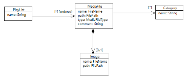
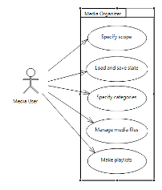
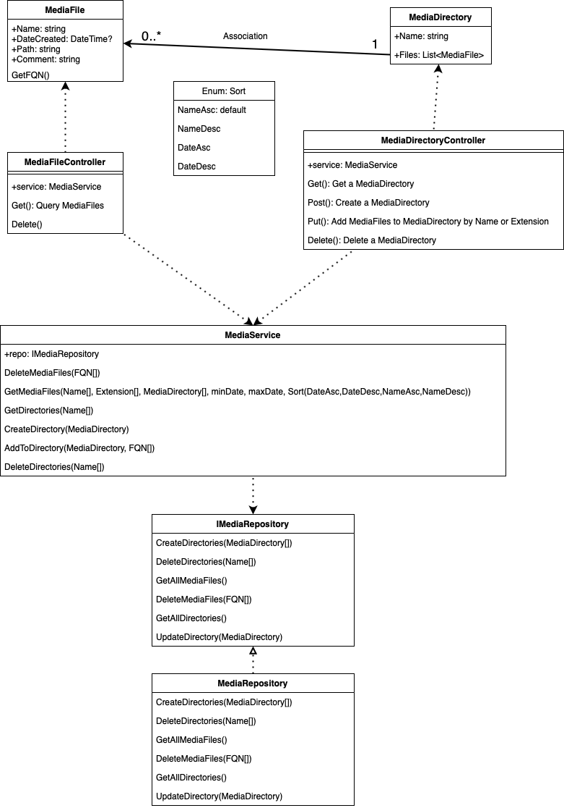
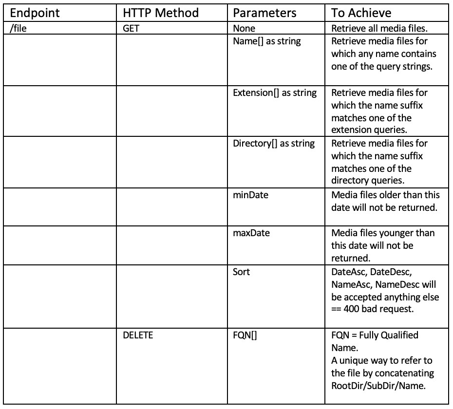
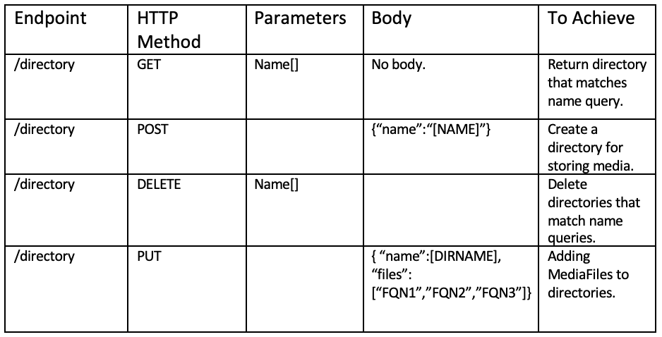

# ApprenticeshipSynopticProject-MediaOrganiser
Synoptic project for my level 3 software development apprenticeship. 
 The contents of this file are as follows: 
* *User Guide* 
* *Project Introduction and Requirements* 
* *Design Document* 
  
# User Guide
System Requirements: 
* Any unix like operating system that has support for hierarchical file systems and .Net 5 SDK.
* .Net 5 SDK.

Important Notices: 
* Due to time constraints and a Code-Driven-Development approach. Automated testing of code like unit tests or integration tests have not been created. All
  testing has been carried out using the Swagger UI and curl command.
* The swagger UI is configured to utilise comments from the code into meaningful annotations to the 
action methods available for MediaFile and MediaDirectory endpoints. The swagger UI is only deployed when
  the launchsettings.json ASPNETCOREENVIRONMENT environment variable is set to "Development".
  * Navigate to http://applicationURL:5000/Swagger to view API documentation and to test out the action methods.

* Due to time constraints, this application can sort files into directories only once, the feature for seamless directory modification and manipulation
will be delivered in a future sprint.
  
* The application assumes that there will be a number of Media files of various types within a single directory
that the application will use at it's "Root Directory", the Root Directory block within appsettings.json
  *must* be configured with the absolute path to that directory. Please ensure a trailling slash
  is included for example "C:\Users\User\Media\\" or "/Users/user.user/Media/"
  
* Once a sub directory has been created and media files have been added. There is no way to modify the directory. In order to release the files moved
 from the root directory from the sub-directory, you will need to delete the directory and create a new one. Deleting a directory will move it's
  contents back to the root directory.

 How to run the program: 
* You can run the program from within any good IDe that has tools or extensions available for .Net 5 development.
* You can run the program from the command line. Ensure when you install the .Net SDK that the CLI is properly setup.
Navigate to the root of the project (MediaOrganiser/MediaOrganiser/) and type: dotnet run.
  
How to call the endpoints:
* Refer to Swagger UI for documentation of endpoints and to call endpoints through the UI.
* You can use curl -v "appURL" to send a get request from your command line terminal.
* You can use curl -v -X DELETE|PUT|POST "appURL" to send another kind of HTTP request from your command line terminal.

# Introduction

This document is designed to outline the requirements and design relating to the SDT Project A: Media Organiser. 
I have been provided with the following UML Class Diagram and Use-Case. I will be creating my own versions of these to better describe the solution. 
•	Whizzy Software develops software components for clients in media industries: music, video, radio, TV etc. 
•	This project, for one of their clients, is to build a component intended to form part of larger systems which will need to be ported to other platforms. 
•	The component will be used as a fully-functional prototype that the client can use to test requirements with their own customers. 

I plan to create a web API backend and, if possible, an example front-end for this web API.

# Requirements

Functional Requirements:

a)	Solution must be able to read files from repository paths. 
b)	Solution must be able to handle different file formats. 
c)	Solution must be able to persist it’s internal state.  
d)	Solution must be able to organise media files. 
e)	Solution must be able to perform CRUD operations for directories ie playlists. 
f)	Solution must utilise a local filesystem.

Non-functional Requirements:

a)	Solution must be accessible via various client devices (tablets, mobiles, laptops etc). 
b)	Solution must be able to respond to HTTP requests within one second. 

# Design Proposal
**Overview** 
I Intend to first create a .Net 5.0 Web API that will serve as the backend and essentially, the heart of the media organiser. I will expose various endpoints (defined later in the design section of this document) that will provide required functionality as defined in the Requirements section of this document. Using a RESTful Web API as backend will allow any number of applications or clients to utilise the media organiser through HTTP/HTTPS requests. 
 **Assumptions and Decisions** 
The media to be organised will already exist in a hierarchical file system at a location defined within the appsettings.json file within the RootDirectory block. The path to root directory must end with a forward slash or black slash depending upon your file system path requirements. 
The application will focus on organising media through the file extensions and nothing else. Directories/Playlists will be created as sub-directories to the RootDirectory path and all files will be stored or retrieved from this root directory and it’s sub directories. 
Sorting of media will always be undertaken due to the use of an Enum for user sorting options, the default value for sorting is ascending by Name. 
 **Tools, frameworks, languages** 
Programming Languages: 	C#  
Frameworks:  			.Net 5.0 and ASP.Net Core  
.Net Libraries:	System, System.IO, System.Linq, Microsoft.AspNetCore, Microsoft.OpenAPI.Models, Microsoft.Extensions.Logging, Microsoft.Extensions.Configuration, Microsoft.Extensions.DependencyInjection & Microsoft.Extensions.Hosting. 
IDE/Code editor:		JetBrains Rider  

 **Component Architecture** 
This Web API backend component will conform to the ASP.Net Core MVC and .Net 5.0 API conventions and standards as identified in provider documentation. 
Please view the UML Class Diagram below for a clear view of the class architecture:

# Endpoints
Please run the application and refer to the Swagger UI (deployed on startup but if not reachable through localhost:5000/Swagger.index.html).
The UI has taken an XML document produced through /// comments in source code and appended them to relevant action methods. You can slo try out the endpoints using the Swagger UI. 
 
Below are the original endpoint design tables. Please note the implementation may be slightly different: 

 

